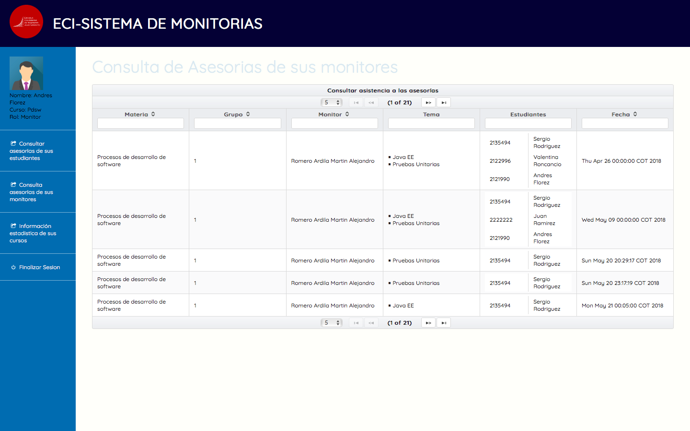
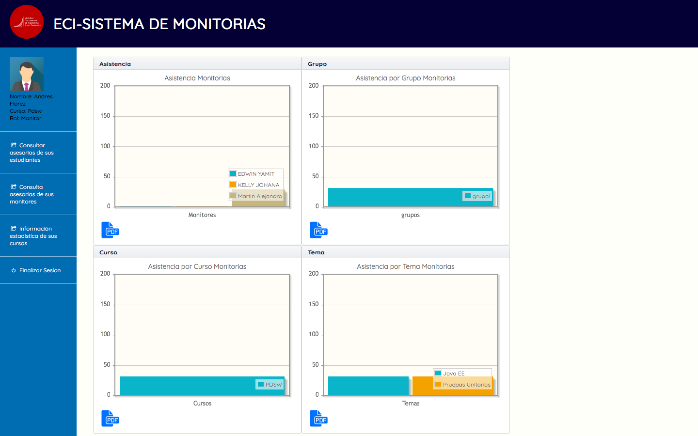
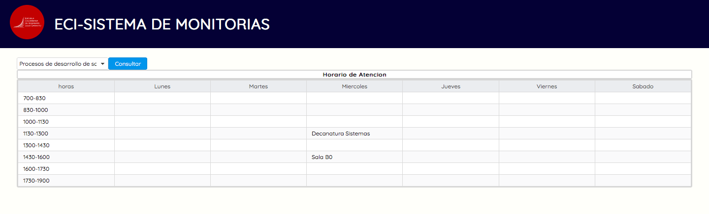
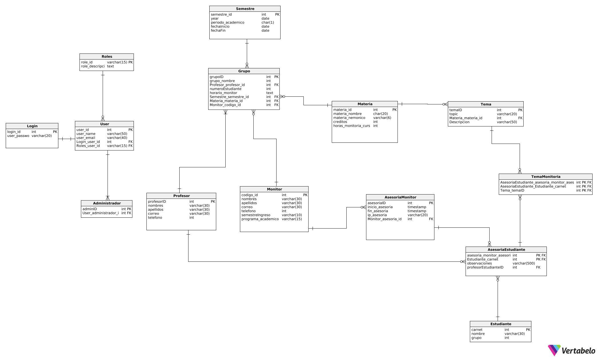
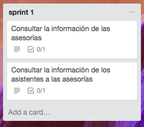
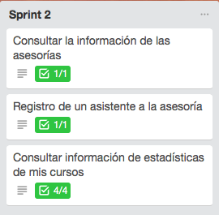
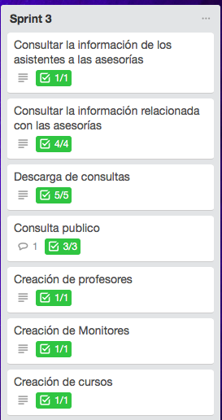

# PDSWproject2018-1-SistemaMonitores
# Semestre 2018-1
   - Curso: Proceso de Desarrollo de Software (PDSW)

# Integrantes
  - Andres Florez
  - Andres Vasquez
  - Francisco Chavez (Product Owner)
  - Karen Mora
  - Rafael Jimenez
  - Sergio Rodriguez (Scrum Master)
 
# Descripcion del producto
#####  Sistema de monitoria de la Escuela Colombiana de Ingenieria Julio Garavito
El sisemta es capaz de realizar un control sobre las monitorias que se realizan en la institución y facilita la gestión de información  de los monitores y sobre el comportamiento de los estudiantes sobre las materias actualmente dictadas en la escuela.

## Funcionalidades mas importantes

##### Consultar Informacion de las monitorias hechas por los monitores.
Un profesor puede consultar las monitorias realizadas por sus monitores asignados.
 

##### Consultar Informacion de las monitorias recibidas por los estudiantes.
Un profesor puede consultar las monitorias a las que asistieron sus estudiantes
 

##### Generar un informe sobre las monitorias y su situacion actual
Un profesor puede generar un informe sobre la situacion actual de las monitorias para poder tomar decisiones sobre ella
 

##### Consultar el horario de atencion de las monitorias
Cualquier persona puede consultar el horario de atencion  a las monitorias, para poder determinar a que monitorias asistir.
 

# Arquitectura y Diseño detallado 
##### Diagrama E-R

#### Descripcion de la arquitectura
#### Capas
- Vista: consiste en todos los elementos que componen la interfaz grafica del usuario, en el proyecto corresponden a los elementos contenidos en Views.
- Controlador: consiste en todos los elementos que conectan al modelo con la vista,en nuestro proyecto se refiere a los managedBean.
- Modelo: consiste en toda la unidad logica e informacion, que en nuestro proyecto se encuentra ubicado en entities.

#### Tecnologia usada
- Para la interfaz grafica se utilizo Primefaces que es un componente OPS para facilitar la creacion y manipulacion de elementos de la interfaz.
- Se utilizo Guice para realizar la inyeccion, esto facilita que sea el mismo gestor quien determine que necesita para crear cada objeto y garantizar su iniacion sin fallos.
- La base de datos es gestionada con un sistema PostgreSQL, que al estar enfocada en objetos-relacional facilita la integracion con Java.

# Descripcion del proceso
##### Metodologia
 - Se realizo el desarrollo de la herramienta usando la metodologia de SCRUM, la cual facilita el trabajo en equipo y garantiza que el cliente participe activamente en el proceso para garantizar que el programa se ajuste a lo requerido por el cliente.
 - El backlog puede ser consultado en la pagina https://trello.com/b/kAGQ4HfE
 
 ### Link Heroku: https://sistemamonitoriaaakaa.herokuapp.com/ 
 
 # Sprints
 ### Sprint 1
 

 ### Sprint 2
 

  ### Sprint 3
 

