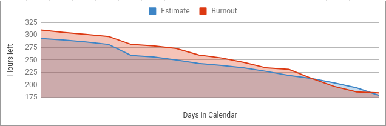

# PDSWproject2018-1-SistemaMonitores
# Semestre 2018-1
   - Curso: Proceso de Desarrollo de Software (PDSW)

# Integrantes
  - Andres Florez (Team Develop)
  - Andres Vasquez (Team Develop)
  - Francisco Chavez (Product Owner)
  - Karen Mora (Team Develop)
  - Rafael Jimenez (Team Develop)
  - Sergio Rodriguez (Scrum Master)
 
# Descripcion del producto
#####  Sistema de monitoria de la Escuela Colombiana de Ingenieria Julio Garavito
# Sistema General
Como expicacion general de la aplicacion el sistema de monitorias se basa en diferentes roles que permiten registro de la monitoria, inicializacion de roles, horario publico ,estadisticas de las monitorias
# Sistema explicacion Especifica
El sistema de monitorias se basa en manejo de roles en este caso tenemos tres roles
* Rol de Administrador
* Rol de Profesor
* Rol de Monitor
* Usuario Publico
# Rol de Monitor
Para el rol de monitor el monitor puede registrar una monitoria y puede consultar sus monitorias en tal caso se tiene un reloj que contabiliza el tiempo de la monitoria
# Rol Profesor
Para el rol de profesor se tiene consultas estadisticas de consultas generales,consultas por monitor, consultas por curso
se tiene analisis de graficas,ademas de las tablas con el discriminado de toda la informacion de las monitorias por profesor
# Rol de Administrador
Para el rol de administrador se tiene inserciones para tema de los cursos, monitores, profesores, materias o cursos
# Usuario Publico
Para el usuario Publico se tiene una vista inicial de los horarios desde hay inicia y es la raiz de la aplicacion para
login y demas roles.

## Funcionalidades mas importantes

##### Consultar Informacion de las monitorias hechas por los monitores.
Un profesor puede consultar las monitorias realizadas por sus monitores asignados.
 

##### Consultar Informacion de las monitorias recibidas por los estudiantes.
Un profesor puede consultar las monitorias a las que asistieron sus estudiantes
 

##### Generar un informe sobre las monitorias y su situacion actual
Un profesor puede generar un informe sobre la situacion actual de las monitorias para poder tomar decisiones sobre ella
 

##### Consultar el horario de atencion de las monitorias
Cualquier persona puede consultar el horario de atencion  a las monitorias, para poder determinar a que monitorias asistir.
 

# Arquitectura y Diseño detallado 
##### Diagrama E-R

#### Descripcion de la arquitectura
#### Capas
- Vista: consiste en todos los elementos que componen la interfaz grafica del usuario, en el proyecto corresponden a los elementos contenidos en Views.
- Controlador: consiste en todos los elementos que conectan al modelo con la vista,en nuestro proyecto se refiere a los managedBean.
- Modelo: consiste en toda la unidad logica e informacion, que en nuestro proyecto se encuentra ubicado en entities.

#### Tecnologia usada
- Para la interfaz grafica se utilizo Primefaces que es un componente OPS para facilitar la creacion y manipulacion de elementos de la interfaz.
- Se utilizo Guice para realizar la inyeccion, esto facilita que sea el mismo gestor quien determine que necesita para crear cada objeto y garantizar su iniacion sin fallos.
- La base de datos es gestionada con un sistema PostgreSQL, que al estar enfocada en objetos-relacional facilita la integracion con Java.

# Descripcion del proceso
##### Metodologia
 - Se realizo el desarrollo de la herramienta usando la metodologia de SCRUM, la cual facilita el trabajo en equipo y garantiza que el cliente participe activamente en el proceso para garantizar que el programa se ajuste a lo requerido por el cliente.
 - El backlog puede ser consultado en la pagina https://trello.com/b/kAGQ4HfE
 
 ### Link Heroku: https://sistemamonitoriaaakaa.herokuapp.com/ 
 
 # Sprints
 ### Sprint 1
 

 ### Sprint 2
 

  ### Sprint 3
 

# BurndownChart

# Reporte de pruebas y de cubrimiento de las mismas
Para el reporte de pruebas se hicieron dos bloques de pruebas de aceptacion para registro de monitorias y para
creacion de usuarios

 
